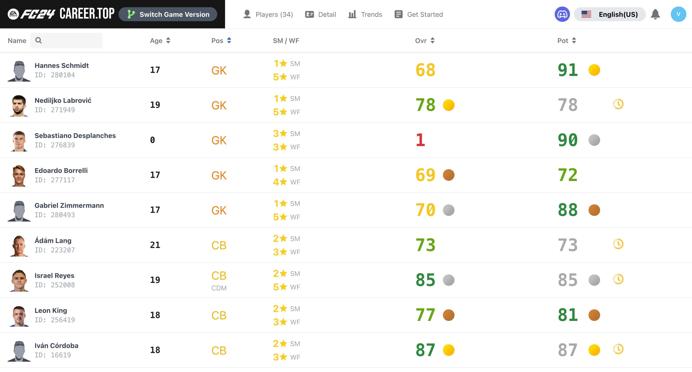
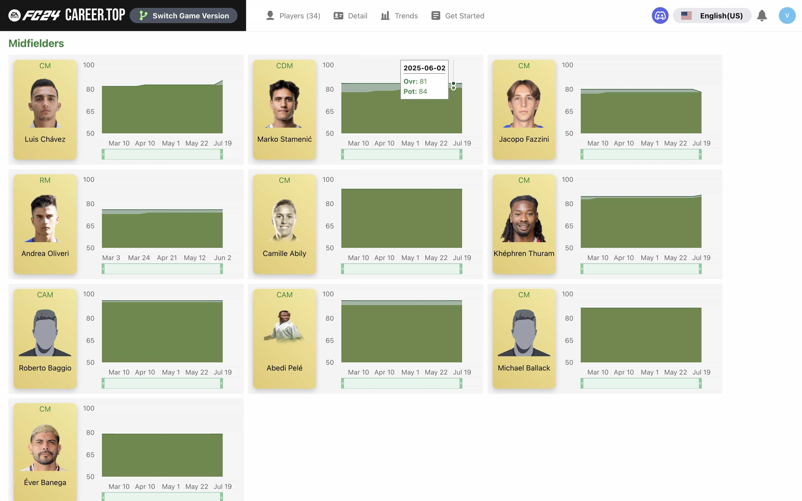
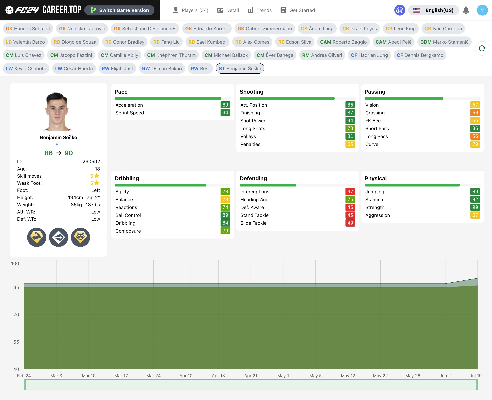
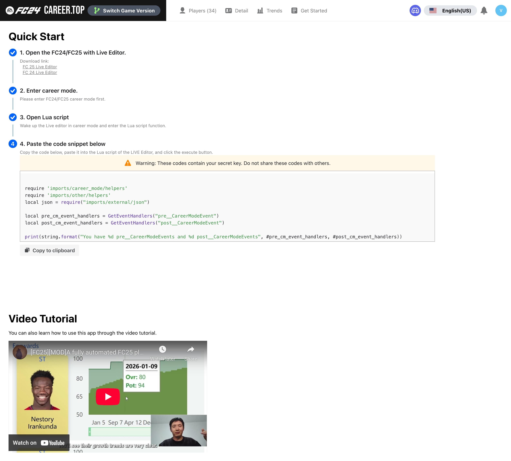
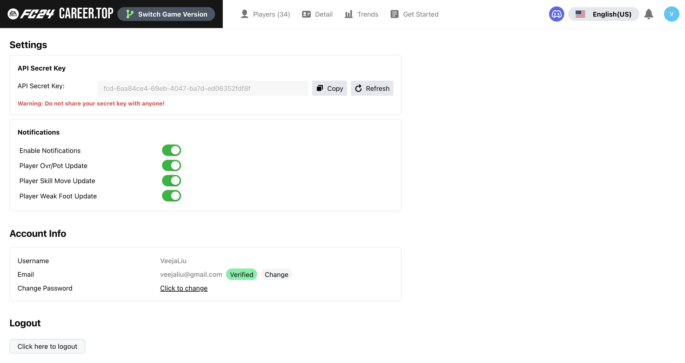

# FIFA-Career-Top-Frontend

A fully functional web application that allows you to track the progress of your players in FIFA 24/25 Career Mode.

This application is designed to work with the **xAranaktu/Live-Editor** to implement automatic updates of player data.

It provides a user-friendly interface to view and analyze player statistics, including overall rating, potential, and trends over time.

## Table of Contents

- [Features](#features)
- [Installation](#installation)
    - [Dependencies](#dependencies)
    - [Usage](#usage)
- [Important Note && Tips](#important-note--tips)

## Features

- View all players in your team, monitor their overall rating, potential.
- View players' trends of overall rating, potential.
- Silent operation, real-time updates (weekly in-game updates, configurable)
- Player details page
- Notification when a player's overall rating or potential changes
- Notification when a player's weak foot or skill moves changes
- Golden player, which shows the top 3 players(overall, potential) on same position.
- multiple language support (English, Chinese, French, Dutch, Japanese)

And more features are coming soon.

**List page:**

**Trend page:**

**Detail page:**

**Get started page:**

**Settings page:**

## Installation

### Dependencies

- Latest **xAranaktu/FC-24-Live-Editor** or **xAranaktu/FC-25-Live-Editor**
- Lua code, will provide in the GetStarted page.

### Usage

- Open the FC24/FC25 with Live Editor.
- Go to the Lua script tab in the live editor.
- Paste the code snippet in GetStarted page and run the script.

## Important Note && Tips

### 1. The Annoying Black Window! It might steal your focus.

Let me explain how this works. Our application relies on the functions
provided by Live Editor. Whenever the WEEK_PASSED event is triggered in the
game, our Lua script runs, collecting data from all your current team players
and sending it to our server. But here’s the catch: Live Editor doesn’t offer
a way to send API requests directly to an external server, so we’re using
Windows’ Curl command to do that. Unfortunately, every time we run that
command, a black window pops up because we’re executing Curl in the Windows
system. And sometimes, this black window might steal focus from your game,
which is a bummer. It doesn’t happen every time, but it’s possible. It’s far
from perfect, but it’s the best we can do right now. I’m sorry about this
inconvenience, but I’m constantly searching for a better solution. So, while
using this application, please don’t close that black window—it’s busy
sending the API request. If your network isn’t too slow, the window should
disappear quickly. In my experience, it’s bearable since the black window
only pops up once per in-game week. And hey, it’s a small price to pay for
keeping track of your players’ progress, right? Rest assured, I’m on the
lookout for a better solution, and I’ll update the application as soon as we
find one. Thanks for your understanding!

### 2. Only One Save Slot Supported!

During the closed beta, we’re only supporting one save slot. This is because
our server resources are limited, and we can’t provide a separate save for
every single user. Plus, I doubt anyone is switching save files back and
forth that often, so I think this limitation is fair. In the future, we might
offer more save slots, but who knows? The future is full of surprises!

### 3. Issues Caused by Insufficient File System Permissions

Let me explain why this script requires file system permissions. As we
mentioned earlier, we use the command line to directly execute a curl command
to send your player data. However, due to the numerous player attributes, the
JSON data string can get very long, making it impossible to concatenate all
this data in a single line of curl, as it exceeds the command line's allowed
length. Therefore, what I do is write this data to a file first and then
concatenate the file's path in the command. Based on this, please ensure you
have administrative privileges and write permissions for the folder.
Generally, we will write to the root directory of the EA FC game, and if
writing fails, an error will be displayed: "Permission denied."
